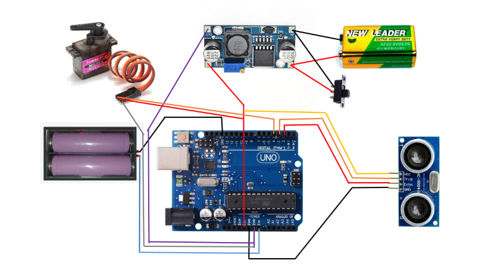
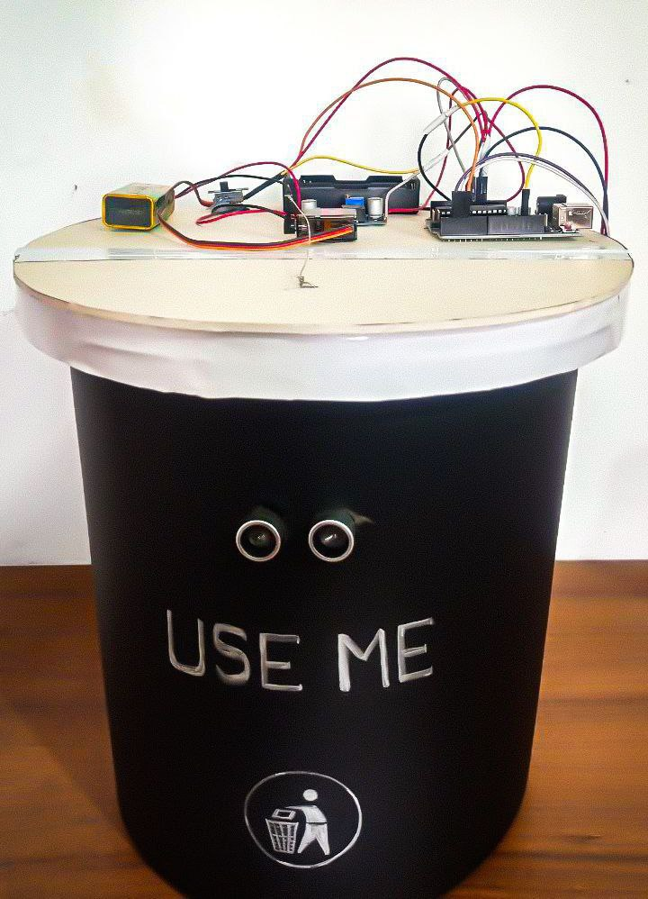

# 🌟 Smart Dustbin Project

## 📌 Overview

The **Smart Dustbin** is an innovative project designed to automate the opening and closing of a dustbin lid using an ultrasonic sensor and a servo motor. This project enhances hygiene by enabling touchless waste disposal, reducing the spread of germs.

---

## 🛠️ Components Used

✅ **Arduino Board**  
✅ **Ultrasonic Sensor (HC-SR04)**  
✅ **Servo Motor**  
✅ **Jumper Wires**  
✅ **Power Source**  

---

## 🔧 Circuit Diagram

📷 **Circuit Design:**



---

## 🚀 How It Works

🔹 The **ultrasonic sensor** continuously measures the distance of any approaching object.  
🔹 If an object (e.g., a hand) is detected within a predefined threshold distance, the **servo motor** opens the dustbin lid.  
🔹 The lid remains open for **3 seconds** and then closes automatically.  

---

## 💻 Code Implementation

```cpp
#include <Servo.h> // Includes the Servo library

Servo myservo; // Create a servo object

#define echopin 2  // Echo pin of the ultrasonic sensor
#define trigpin 3  // Trigger pin of the ultrasonic sensor

int set_cm = 100; // Threshold distance in cm

long ultra_time; // Time for ultrasonic pulse
long dis_cm;     // Calculated distance in cm

void setup() {
  Serial.begin(9600);
  myservo.attach(4);
  myservo.write(0);
  pinMode(trigpin, OUTPUT);
  pinMode(echopin, INPUT);
  delay(1000);
}

void loop() {
  ultra_read();
  Serial.print("Distance (cm): ");
  Serial.println(dis_cm);

  if (dis_cm < (set_cm - 5)) {
    openLid();
  } else if (dis_cm > (set_cm + 5)) {
    closeLid();
  }
  delay(100);
}

void ultra_read() {
  digitalWrite(trigpin, LOW);
  delayMicroseconds(2);
  digitalWrite(trigpin, HIGH);
  delayMicroseconds(10);
  digitalWrite(trigpin, LOW);
  ultra_time = pulseIn(echopin, HIGH);
  dis_cm = ultra_time / 29 / 2;
  if (dis_cm > 200 || dis_cm < 0) {
    dis_cm = set_cm + 10;
  }
}

void openLid() {
  myservo.write(110);
  delay(3000);
}

void closeLid() {
  myservo.write(0);
}
```

---

## 🎥 Working Demonstration

📸 **Project Images:**

  


🎬 **Watch Project Video:**  
[📽️ Click Here to Watch](https://drive.google.com/file/d/1NzTowrX0pUmRH7Gef5DPdUlVBN942nG1/view?usp=sharing)

---

## 🔮 Future Improvements

🚀 Adding a **weight sensor** to notify when the bin is full.  
🌐 Implementing **IoT integration** for remote monitoring.  
☀️ Powering the dustbin with **solar energy**.  

---

## 📜 License

This project is **open-source** and available for modifications and improvements. Feel free to contribute! 💡

---

⭐ **If you like this project, don't forget to star this repository on GitHub!** ⭐

